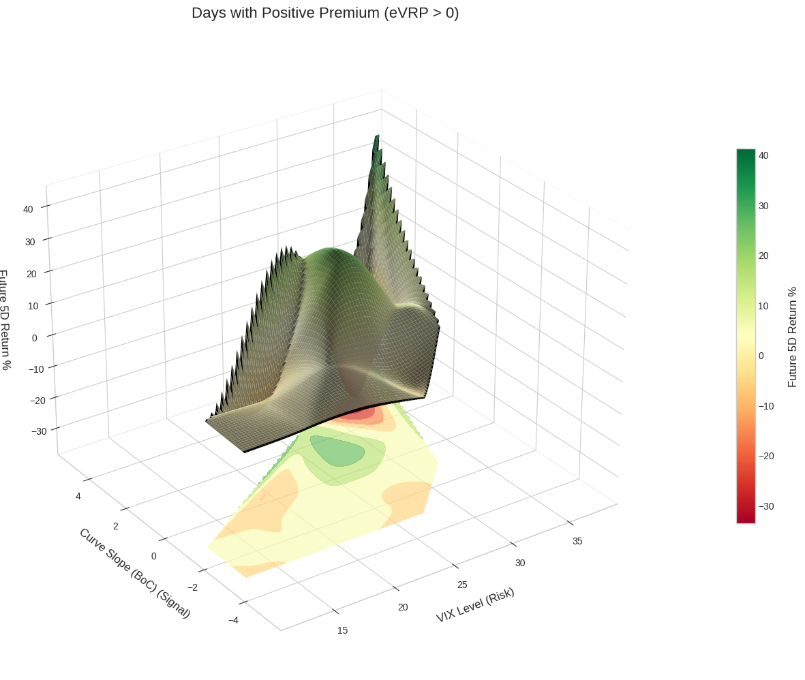
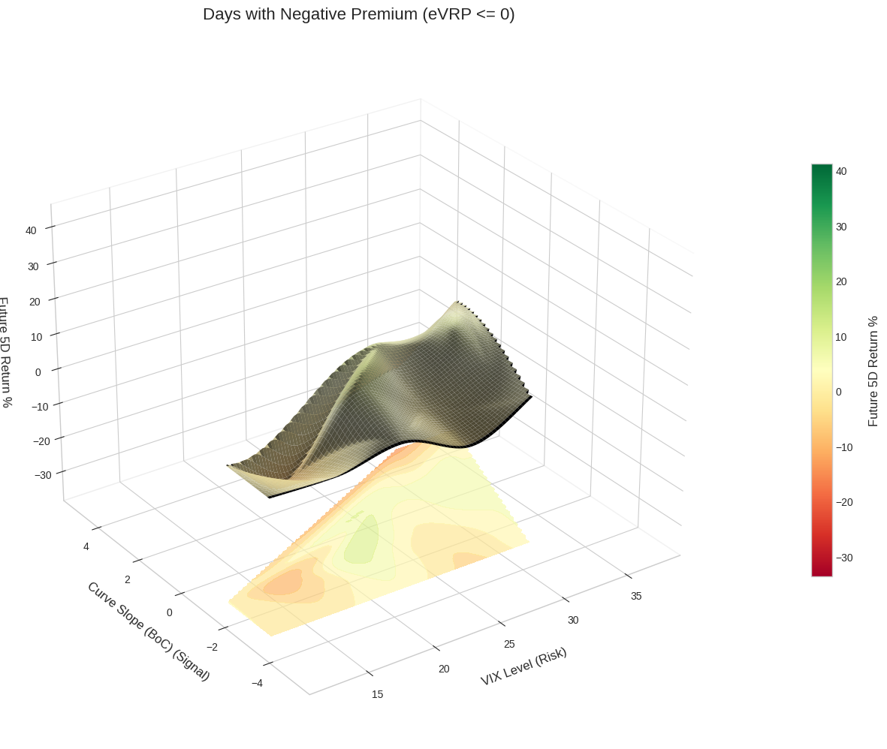

# Volatility Regime Analysis

This repository contains a Python-based quantitative analysis of volatility trading regimes, using `yfinance`, `pandas`, and `matplotlib` (3D plots).

The goal is to move beyond the simple "Contango vs. Backwardation" signal and identify *when* shorting volatility is genuinely profitable.

---

## The Dual-Signal Insight

The common wisdom is to short volatility when the VIX curve is in **Contango**. This project tests that assumption by adding a second, more important filter: the **Volatility Risk Premium (eVRP)**.

1.  **Curve Slope (BoC):** The "Regime" signal.
    * `BoC = VIX (30d) - VIX3M (90d)`
    * `BoC < 0` = Contango (normal)
    * `BoC > 0` = Backwardation (panic)

2.  **Volatility Risk Premium (eVRP):** The "Premium" signal.
    * `eVRP = VIX (Implied Vol) - eRV (Realized Vol)`
    * `eVRP > 0`: A positive premium exists (the market is "overpaying" for protection).
    * `eVRP <= 0`: The premium is negative (selling volatility is "undervalued" and dangerous).

---

## A/B Test: The Importance of the Premium

The analysis splits the trading days into two separate universes to visualize the *true* driver of returns. The Z-axis (height and color) represents the 5-day future return of a short volatility ETN ($SVIX).

### Plot A: Profitable Regime (eVRP > 0)

This plot shows all days when a positive risk premium existed (`eVRP > 0`).

**Insight:** When the market is paying a premium, the Contango rule works perfectly. The `BoC < 0` (Contango) region clearly shows a "profit hill" (green).

### Plot B: "Toxic" Regime (eVRP <= 0)

This plot shows all days when the risk premium was negative (`eVRP <= 0`).

**Insight:** This is the key finding. When the premium disappears, the strategy fails. Even in the Contango region (`BoC < 0`), the "profit hill" vanishes, revealing a flat or highly unprofitable (red) surface.

---

## Baseline Analysis (Simple Regime)

For context, this is the simple, "obvious" analysis that combines all data. It dangerously "hides" the toxic regime by averaging it with the profitable one.

